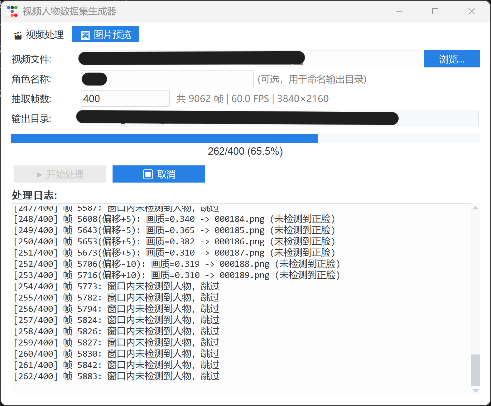

# 🎬 VideoPersonDataset

一个基于 YOLO 的智能视频人物数据集生成工具，支持从视频中自动抽取帧、检测人物、智能裁切和人脸聚类分类。

## ✨ 功能特性

- **视频抽帧**：从视频中随机抽取指定数量的帧
- **人物检测**：使用 YOLOv8x 自动检测画面中的人物
- **智能裁切**：以人物为中心智能裁切，自动调整构图比例
- **人脸聚类**：基于 InsightFace 的人脸特征提取与 DBSCAN 聚类，自动按人物分类
- **图形界面**：现代化的 GUI 界面，支持图片预览、删除和管理
- **批量处理**：异步加载，支持大批量图片处理

## 📸 界面预览



## 🚀 快速开始

### 1. 安装依赖

```bash
pip install ultralytics pillow numpy opencv-python-headless insightface scikit-learn nicegui pyiqa torchvision
```

### 2. 启动程序

```bash
python gui_app.py
```

### 3. 使用流程

1. 选择视频文件
2. （可选）输入角色名称用于命名输出目录
3. 设置抽取帧数
4. 点击"开始处理"
5. 处理完成后自动跳转到预览页面
6. 在预览页面审查、删除不合格的图片

## 📁 项目结构

```
VideoPersonDataset/
├── gui_app.py           # 图形界面应用
├── video_processor.py   # 视频处理核心模块
├── dataset_select.py    # 原始图片处理脚本（命令行版）
├── output/              # 输出目录（自动创建）
│   ├── 20260302_143025_角色A/
│   │   ├── 000001.png
│   │   ├── 000002.png
│   │   ├── Person_000/   # 聚类分类目录
│   │   └── Person_001/
│   └── ...
└── README.md
```

## ⚙️ 输出格式

处理后的图片保存在 `./output/{时间戳}_{角色名}/` 目录下：

- 图片命名：`000001.png`, `000002.png`, ...
- 人脸聚类后自动分类到 `Person_000/`, `Person_001/`, ... 子目录
- 未检测到人脸的图片移动到 `Uncategorized/` 目录

## 🔧 技术栈

| 组件 | 技术 |
|------|------|
| 人物检测 | YOLOv8x (Ultralytics) |
| 人脸识别 | InsightFace (buffalo_l) |
| 聚类算法 | DBSCAN (scikit-learn) |
| 图像处理 | Pillow, OpenCV |
| GUI 框架 | tkinter + ttkbootstrap |

## 📋 系统要求

- Python 3.8+
- CUDA（可选，用于 GPU 加速）
- 内存：建议 8GB+

## 📄 许可证

MIT License

## 🙏 致谢

- [Ultralytics YOLOv8](https://github.com/ultralytics/ultralytics)
- [InsightFace](https://github.com/deepinsight/insightface)
- [ttkbootstrap](https://github.com/israel-dryer/ttkbootstrap)